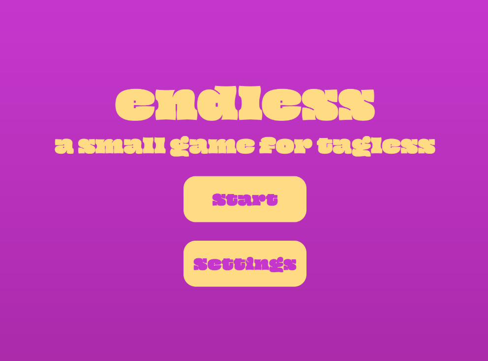

# endless
A small game for tagless.


[Try it out!](https://np3-0.github.io/endless/)

## About
Endless is a small project I made to see how polished I can make a game in around 5 hours. It includes:
* Progressive, randomized, difficulty!
* Custom sprites with animations!
* Background music and sound effects!
* And more!

### How It Works
You control a player that can move between one of three spots using the arrow or WASD keys. Each 45 frames (around 0.75 seconds), an enemy will spawn in at one of the three positions randomly, where you must dodge it. Each time an enemy misses, it causes the score to go up by 100. Every second, the score also increases by 1, and enemy speed is multiplied by 1.035.
<br>
For sprites, the spritesheets are loaded into the game, where a function splits them into separate images in an array. This is then looped through in the game at a speed of 1 image per 7 frames (around 8 images a second). For the enemy sprite, the images are also rotated downwards before being shown.
<br>
Lastly, game state is controled by a global variable, which starts at 0. When the game starts, it goes to one, which renders the game. Once the user dies, it switches to the game over screen. The same methodology appears for the credits as well.

### Running Locally
Firstly, clone the repo. Since this project has media, you need to use a local server:

```bash
# Using Python
python -m http.server 8000

# Using Node.js
npx http-server

# Using VS Code Live Server extension
# Right-click index.html -> "Open with Live Server"
```
I personally used the live server for developing, and it worked fine.

### Credits

- [p5.js 2.0](https://beta.p5js.org/)
- [Derelict pixels, for the player sprites](https://derelict-pixels.itch.io/astro-knight-4-directions-player)
- [Ansimuz, for the enemy sprite](https://ansimuz.itch.io/warped-shooting-fx)
- [Pixabay's royalty free audio](pixabay.com)
- My high school's CS teacher for making me learn this confusing language.
- alex, for convincing me to get a bag tag.


### Enjoy!
by nate (np3)

Shield: [![CC BY-NC-SA 4.0][cc-by-nc-sa-shield]][cc-by-nc-sa]

This work is licensed under a
[Creative Commons Attribution-NonCommercial-ShareAlike 4.0 International License][cc-by-nc-sa].

[![CC BY-NC-SA 4.0][cc-by-nc-sa-image]][cc-by-nc-sa]

[cc-by-nc-sa]: http://creativecommons.org/licenses/by-nc-sa/4.0/
[cc-by-nc-sa-image]: https://licensebuttons.net/l/by-nc-sa/4.0/88x31.png
[cc-by-nc-sa-shield]: https://img.shields.io/badge/License-CC%20BY--NC--SA%204.0-lightgrey.svg